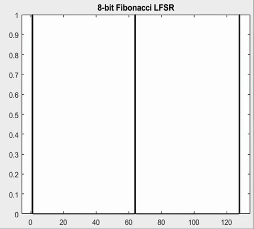
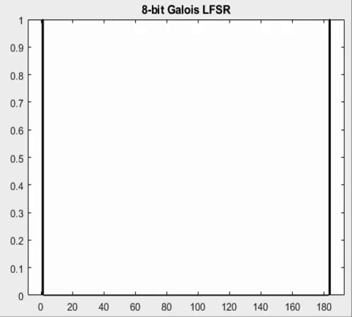

# Linear Feedback Shift Register (LFSR)

> SystemVerilog LFSR module   

Implementention in SystemVerilog of __Fibonacci and Galois LFSR__.  

Principle of operation and tap locations for maximum length realizations can be found in [Wikipedia](https://en.wikipedia.org/wiki/Linear-feedback_shift_register) and [EE Times](https://www.eetimes.com/tutorial-linear-feedback-shift-registers-lfsrs-part-1/).

## Get Started

The source files  are located at the repository root:

- [Linear Feedback Shift Register (LFSR)](./LFSR.sv)
- [Linear Feedback Shift Register (LFSR) TB](./LFSR_TB.sv)

## LFSR Architecture
Modify the 'TYPE' parameter to select LFSR architecture type:
- Fibonacci LFSR ('many-to-one') : TYPE='0'.
- Galois LFSR ('one-to-many') : TYPE='1'.
- Extending number of possible states in the Fibonacci architecture : EXTEND='1'.

## Testbench

-The testbench comprises two maximum length LFSR cases (8-bit and 16-bit).
-The seed in both cases is 'd1. The seed value and the tap locations can be changed via the parameters in the TB file. 
-The LFSR output words are manually extracted from QuestaSim to a text file and plotted as a dynamic histogram to visualize the LFSR operation as follows:

1.	Maximum-length 8-bit conventional Fibonacci LFSR  (2^n-1 states)
	
	 

2.	Maximum-length 8-bit Galois LFSR  (2^n-1 states)
	
	 

## Support

I will be happy to answer any questions.  
Approach me here using GitHub Issues or at tom.urkin@gmail.com